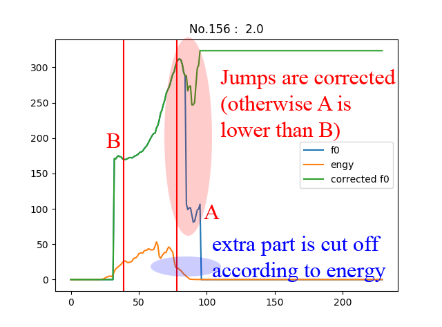

# SpeechLab-Tone-Classification Report

littleRound lxy9843@sjtu.edu.cn Speechlab-xyl98

[TOC]

## Task description

### Short version

Classify tones of single Chinese characters (different characters in different cases) by their f0/engy sequences.

### Kaggle version

```
train/ - training data
dev/ - validation data
test/ - difficult test data
Each dir includes the f0 and engery features extracted from corresponding wav files. Each wav file is the pronunciation of a single Chinese character.

Note that the length of different wav file may be different. Hence, the f0/engy files corresponding to different character may also have different length. But for the same character, the f0 file will have exactly the same length as the engy file.

The naming convention for subdir and file name is as below:

subdir name indicates the correct tone.
filename pattern is

{pron}{tone_lable}.f0 {pron}{tone_lable}.engy

where pron is the pronunciation of the character and tone_lable is the tone of that character, i.e. 1, 2, 3 or 4.

Please design a tone classifer with the f0/engy file as the input and output the tone label.
```

### Illustration

Notice: values have been scaled and have different units.


## My solution

### Timeline

- [1 day] Naive fully-connected network
    - Accuracy < 50%
- [3 days] CNN (with difference sequence)
    - Accuracy 60% - 70%
- [4 days] fine-tuned 1D-CNN with some simple tricks
    - Accuracy 82% - 90%
    - 1st in LeaderBoard for less than 1 day
- [1 day] Manual annotation (a bit cheating, discarded at last)
    - Accuracy 91% - 94%
    - Validate my assumptions (intuitions)
    - Two submissions to find out my best (94%)
- [2 days] fine-tuned Rule-based classifier with a few tricks
    - Accuracy 99.122% (100% on dev)
    - Use my assumptions validated before (no label used)
    - 1st in LeaderBoard at last

### Observations and assumptions

1. The shape of the f0 sequence determines the tone.
2. Only a short sequence is valid in the classification. (Or is enough to indicate the tone.)
3. There are flaws in f0-detection causing jumps in sequence.
4. It's hard to distinguish ```TONE 1``` directly, but the case is relativily easier for the rest three. 

### Rules

#### parameters: 
- [```findValidRange```]: [```f0_th```] [```cut```] [```engy_th```]
- [```correct_jump```]: ```threshold```
- [```stupidJudge```]: [```up_thres```] [```down_thres```] [```turn_thres```]

#### steps

1. Preprocess
    - (Trivial) Scale engy to make life easier.
    - [```findValidRange```] Find valid duration of time for tone-classfication.
        - If the sequence start with ```f0 < [f0_th]```, say ```[f0_th] = 1 ```, then in this period of time f0-detection is not working. The data is invalid.
        - If the sequence start with ```engy < [engy_th]```, then in this peroid of time there's hardly any sound. The data is invalid.
        - Some unexpected detection result may occur at both the beginning and ending of the pronunciation. We'd better cut them off.
    - [```correct_jump```] Correct mistakes made in f0-detection.
        - If a sudden jump occured in f0 sequence (```f0[i+1] / f0[i] > [threshold]```) , scale all f0 after that point so that ```f0[i] = f0[i+1] ```.
            - Reasonable because we only care about the **trend**0 of f0, not actual value. 

2. [```stupidJudge```] Classfication
    - Only use **corrected** f0 sequence in **valid range**.
    - Set $ m := min(f0_sequence) $ .
    - If ```f0[begin]/m > 1 + [turn_thres]``` and ```f0[end]/m > 1 + [turn_thres]```
        - return ```TONE 3```
    - If ```f0[end]/f0[begin] > 1 + [up_thres]```
        - return ```TONE 2```
    - If ```f0[end]/f0[begin] < 1 + [down_thres]```
        - return ```TONE 4```
    - If it is not the cases above
        - return ```TONE 1```

#### iillustration:





### Parameter tuning

Every time after I updated my parameters, I run a script that outputs the accuracy rate along with specific detailed diagrams showing which case is predicted incorrectly in training set. After observing why mistakes happened I'm able to get the intuition needed for tunning all parameters or new method to process data.

(data.zip password hint: g****a)